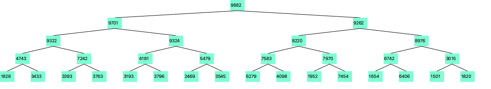

# Maxheap

This project contains a Maxheap java implementation and its visualization using
javafx.

## Development

Running the code will generate the file `/tmp/maxheap.png`.

```bash
sbt run
```

Example of a randomly generated heap with 31 nodes.



Running tests

```bash
sbt test
```

### Requirements

The code has been written with jdk8 including javafx.

If you're running [sdkman](https://sdkman.io/).

```bash
sdk install java 8.0.232.fx-zulu
sdk use java 8.0.232.fx-zulu
```
